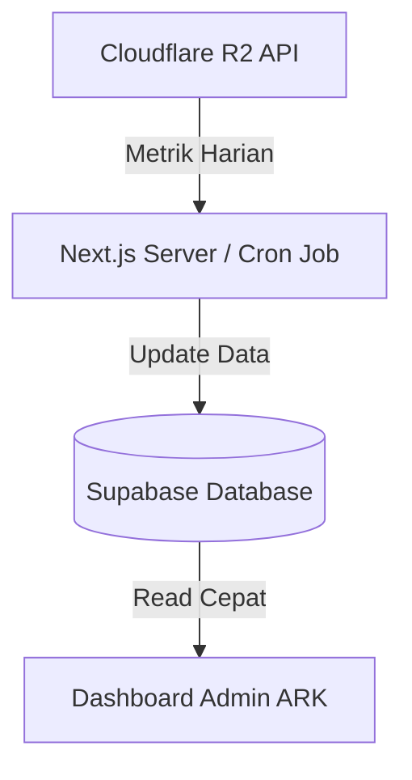

# Dokumentasi Sistem & Analisis Kebutuhan ARK
*(Audio Recording for the Kingdom)*

Dokumentasi ini mencakup arsitektur sistem, kebutuhan perangkat keras di lapangan, perencanaan kapasitas penyimpanan (*media storage*), analisis biaya operasional, serta langkah-langkah mitigasi keamanan untuk aplikasi perekaman audio/video ARK.

---

## 1. Kebutuhan Lapangan & Skala Proyek

Proyek ARK dikerjakan oleh tim penerjemah yang tersebar di berbagai daerah di Indonesia dengan rincian operasional sebagai berikut:

* **Distribusi Tim:** 19 Bahasa suku di seluruh Indonesia.
* **Target Konten:** 27 Cerita Alkitab yang diterjemahkan.
* **Jadwal Kerja:** Setiap tim bahasa menerjemahkan **1 cerita per bulan** (Total durasi proyek: **27 bulan**).
* **Ukuran File Template (Statis):**
  * 1 Video Panduan (maksimal ~100 MB per cerita).
  * 2 Audio Referensi (2 × ~10 MB = ~20 MB per cerita).
  * **Total Template per Cerita:** ~120 MB.
* **Ukuran File Output (Dihasilkan Suku Lokal):**
  * 1 File Audio Mixing Final (diestimasi maksimal ~100 MB per cerita per tim).

---

## 2. Persyaratan Sistem Perangkat Lokal (System Requirements)

Perangkat keras yang digunakan di lapangan memiliki spesifikasi kelas entri untuk efisiensi anggaran. Berikut adalah spesifikasi target dan arsitektur penanganannya:

### Spesifikasi Laptop Lapangan (Target):
* **Prosesor:** Intel N-Series (seperti Celeron N3350, Pentium, atau Intel N100).
* **Memori (RAM):** 16 GB DDR4.
* **Penyimpanan:** SSD 512 GB (Asumsi ~200 GB terpakai untuk OS Windows, Office, dan aplikasi dasar; sisa ruang kosong **~300 GB**).

### Arsitektur Penyimpanan Lokal (Mulus & Anti-Lag):
Karena CPU prosesor Intel N-Series memiliki kinerja *single-core* yang terbatas, penulisan file media berukuran besar secara langsung ke jaringan cloud saat merekam dapat menyebabkan *stuttering* (patah-patah) atau rekaman terputus.

> [!IMPORTANT]
> **Metode Solusi:** Aplikasi menggunakan **Metode 1: Penyimpanan Internal Browser (OPFS / Origin Private File System)**.
> * Proses perekaman dan penyimpanan sementara dilakukan langsung ke *sandbox* browser lokal menggunakan thread latar belakang (*Web Workers*).
> * Kecepatan tulis mendekati kecepatan native SSD, sehingga proses perekaman 100% lancar bebas lag.
> * Setelah perekaman selesai, file diunggah ke cloud secara asinkron di latar belakang saat koneksi internet stabil.

---

## 3. Strategi Penyimpanan Cloud (Media Storage) & Analisis Biaya

Berdasarkan analisis kebutuhan transfer data keluar (*Egress*) dan kapasitas penyimpanan (*Storage*), berikut adalah perbandingan infrastruktur cloud yang dievaluasi:

### Tabel Perbandingan Solusi Penyimpanan Cloud

| Fitur | 📁 Google Drive API | ⚡ Supabase Storage | ☁️ Cloudinary | ❄️ Cloudflare R2 |
| :--- | :--- | :--- | :--- | :--- |
| **Biaya Storage** | Gratis (Kuota Workspace) | Gratis 1 GB (Seterusnya murah) | Gratis 25 Kredit (Seterusnya mahal) | Gratis 10 GB (Seterusnya $0.015/GB) |
| **Biaya Egress** | Gratis (Batas ketat) | Gratis 5 GB/bln (Seterusnya \$0.09/GB) | Tergantung Kredit | **Gratis Selamanya (Rp 0)** |
| **Streaming (Range Requests)** | Kurang stabil / Macet | Mendukung penuh | Mendukung penuh | Mendukung penuh |
| **Kemudahan Admin** | Sangat Mudah (Visual Workspace) | Sedang (Developer Dashboard) | Rumit untuk non-IT | Sedang (Developer Dashboard) |
| **Rekomendasi Proyek** | **Hanya untuk Arsip** | **Alternatif Low-Cost Terbaik** | **Tidak Direkomendasikan** (Mahal) | **Pilihan Utama (Paling Efisien)** |

### Perhitungan Akumulasi Data & Estimasi Biaya (Cloudflare R2)

Dengan menggunakan Cloudflare R2, biaya transfer data (*egress*) yang biasanya menjadi komponen termahal di cloud dihilangkan sepenuhnya (Rp 0). 

#### 1. Akumulasi Kapasitas Penyimpanan (Storage):
* **Penyimpanan Template (Statis):** 27 cerita × 120 MB = **3.24 GB** (Diunggah sekali di awal).
* **Pertumbuhan Rekaman Output (Akumulatif):** 19 tim × 100 MB = **1.90 GB per bulan**.
* **Total Storage Bulan ke-27 (Akhir Proyek):** 3.24 GB + (1.90 GB × 27) = **54.54 GB**.

#### 2. Estimasi Tagihan Bulanan (Asumsi Kurs $1 = Rp 15.500):
* **Bulan 1 - 3 (Storage < 10 GB):** **Rp 0** (Masuk kuota gratis R2).
* **Bulan 12 (Storage ~26.04 GB):** Ditagih 16.04 GB $\rightarrow$ **~Rp 3.730 / bulan** ($0.24).
* **Bulan 27 (Storage ~54.54 GB):** Ditagih 44.54 GB $\rightarrow$ **~Rp 10.355 / bulan** ($0.67).
* *Catatan: Biaya request (Class A & B Operations) aman di bawah kuota gratis bulanan (1 Juta Class A & 10 Juta Class B).*

##### Tabel Perbandingan Akumulasi Biaya Bulanan (Bulan 1, 3, 12, dan 27):

| Platform | Bulan 1 (Storage 5.14 GB) | Bulan 3 (Storage 8.94 GB) | Bulan 12 (Storage 26.04 GB) | Bulan 27 (Storage 54.54 GB) |
| :--- | :--- | :--- | :--- | :--- |
| **Cloudflare R2** | **Rp 0** (Free Tier) • Storage: <10 GB (Gratis) • Egress: Rp 0 | **Rp 0** (Free Tier) • Storage: <10 GB (Gratis) • Egress: Rp 0 | **~Rp 3.730 / bulan** • Storage: 16.04 GB berbayar ($0.24) • Egress: Rp 0 | **~Rp 10.355 / bulan** • Storage: 44.54 GB berbayar ($0.67) • Egress: Rp 0 |
| **Supabase Storage** | **~Rp 5.533 / bulan** • Storage: 4.14 GB berbayar ($0.087) • Egress: 3 GB berbayar ($0.27) | **~Rp 6.773 / bulan** • Storage: 7.94 GB berbayar ($0.167) • Egress: 3 GB berbayar ($0.27) | **~Rp 12.338 / bulan** • Storage: 25.04 GB berbayar ($0.526) • Egress: 3 GB berbayar ($0.27) | **~Rp 21.607 / bulan** • Storage: 53.54 GB berbayar ($1.124) • Egress: 3 GB berbayar ($0.27) |
| **Cloudinary** | **Rp 0** (Free Tier) • Total Kredit: 13.14 (Di bawah 25 kuota gratis) | **Rp 0** (Free Tier) • Total Kredit: 16.94 (Di bawah 25 kuota gratis) | **~Rp 1.379.500 / bulan** • Total Kredit: 34.04 (Over limit) • Harus upgrade ke paket **$89/bulan** | **~Rp 1.379.500 / bulan** • Total Kredit: 62.54 (Over limit) • Harus upgrade ke paket **$89/bulan** |
| **Google Drive API** | **Rp 0** (Workspace) • Biaya ekstra: Rp 0 • *Hambatan limit streaming* | **Rp 0** (Workspace) • Biaya ekstra: Rp 0 • *Hambatan limit streaming* | **Rp 0** (Workspace) • Biaya ekstra: Rp 0 • *Hambatan limit streaming* | **Rp 0** (Workspace) • Biaya ekstra: Rp 0 • *Hambatan limit streaming* |

> [!WARNING]
> **Rencana Migrasi & Hambatan Kartu Kredit Developer:**
> * **Rencana Jangka Panjang:** Aplikasi ARK direncanakan menggunakan **Cloudflare R2** pada tahap produksi (**Production**) karena performanya yang mulus dan biayanya yang sangat murah (egress gratis).
> * **Hambatan Saat Ini:** Saat ini developer belum memiliki **Kartu Kredit** untuk keperluan verifikasi billing pendaftaran akun Cloudflare R2 (yang wajib di awal pendaftaran meskipun hanya menggunakan kapasitas di bawah kuota gratis).
> * **Keputusan Sementara:** Untuk mempermudah proses pengembangan dan pengujian saat ini (*sandbox* / *development*), aplikasi **tetap menggunakan Cloudinary (ark-sandbox)**. Begitu aplikasi ARK siap dideploy ke tahap produksi (*production*), pendaftaran kartu kredit akan diselesaikan untuk melakukan migrasi penyimpanan sepenuhnya ke **Cloudflare R2**.

## 4. Keamanan Sistem & Pencegahan Kebocoran Data

Untuk menjaga agar API Key tidak bocor dan menghindari risiko tagihan tidak terduga (*billing shock*), terapkan prinsip keamanan berikut:

1. **Aturan Variabel Lingkungan (.env):**
   * Jangan pernah menambahkan awalan `NEXT_PUBLIC_` untuk API Key rahasia (seperti `CLOUDFLARE_SECRET_KEY` atau Supabase `service_role_key`). Ini mencegah kunci bocor ke sisi browser/client.
2. **Vercel Environment Variables:**
   * Pastikan file `.env` terdaftar di `.gitignore`. Masukkan semua kunci rahasia langsung melalui dasbor Project Settings Vercel. Kode di GitHub akan tetap aman tanpa berisi kunci asli.
3. **Supabase Row Level Security (RLS):**
   * Wajib aktifkan RLS di setiap tabel database Supabase. Buat kebijakan (*policy*) spesifik agar hanya pengguna dengan peran tertentu (misal: `admin`) yang dapat membaca atau menulis data sensitif.
4. **Prinsip Hak Akses Minimal (Least Privilege) di Cloudflare:**
   * Saat membuat token API di Cloudflare R2, batasi hak aksesnya (*Scope*) hanya untuk operasi `Read` & `Write` pada bucket ARK saja. Jangan gunakan hak akses administrator global.

---

## 5. Sistem Monitoring Admin (Offline-first Dashboard)

Agar admin ARK tidak perlu membuka dashboard Cloudflare untuk memantau sisa penyimpanan dan aktivitas transfer data, implementasikan arsitektur monitoring berikut:

1. **Jadwal Sinkronisasi (Cron Job):**
   * Buat fungsi terjadwal (*Cron Job*) yang berjalan otomatis **1 kali sehari** di Next.js server atau Supabase Edge Functions (misalnya setiap jam 12 malam).
2. **Pengambilan Data API:**
   * Cron Job memanggil Cloudflare API untuk mengambil ukuran bucket R2 saat ini (`size` dalam bytes) dan operasi data keluar (`payloadSizeOut` via GraphQL API).
3. **Penyimpanan di Database:**
   * Hasil data disimpan ke tabel khusus `system_metrics` di Supabase.
4. **Keuntungan:**
   * Dasbor admin memuat data secara instan dari database lokal (tidak ada delay koneksi ke Cloudflare).
   * Menghindari kehabisan kuota request API karena tidak ada panggilan berulang dari browser admin ke Cloudflare.
